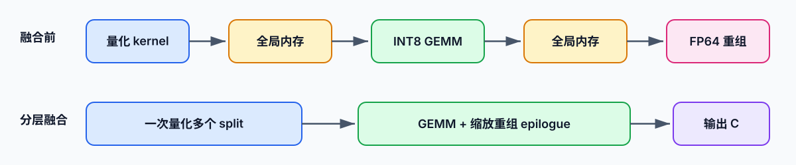
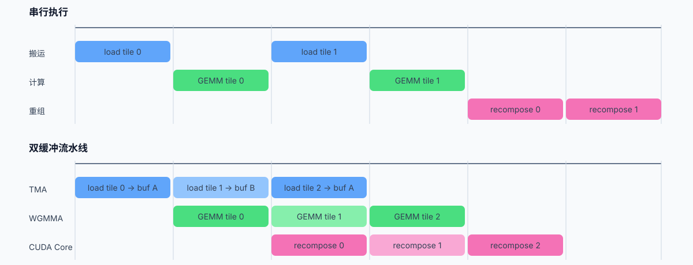
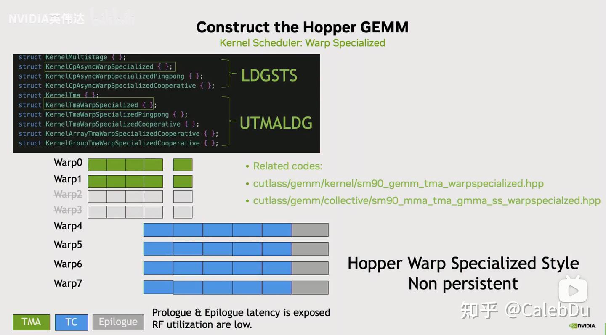
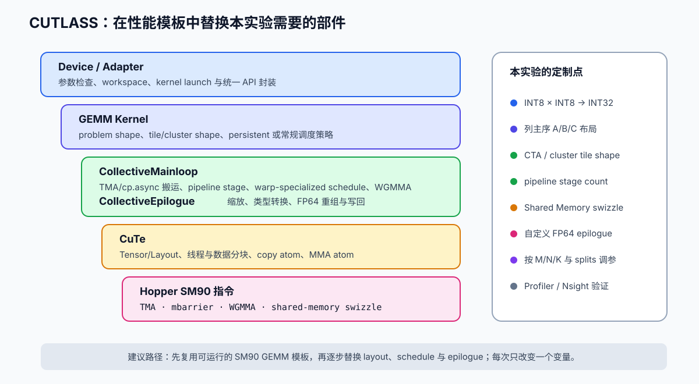
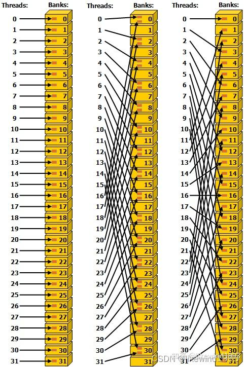
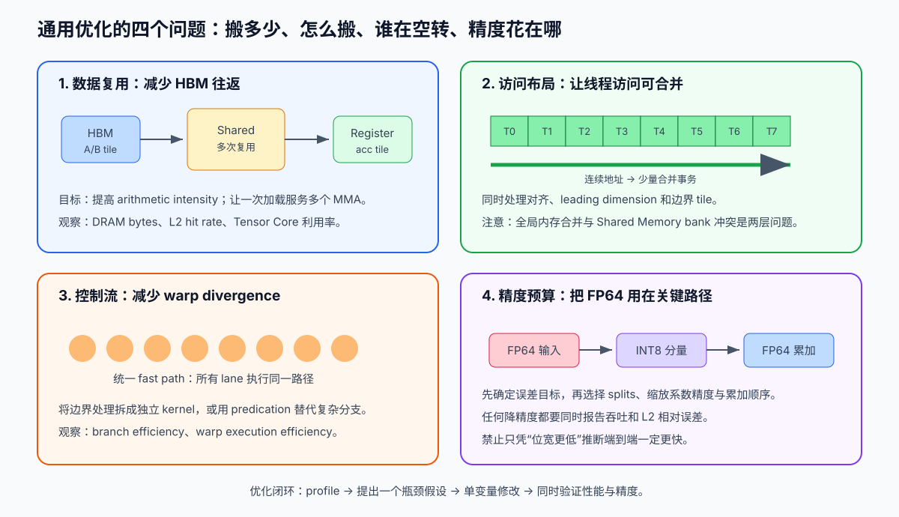
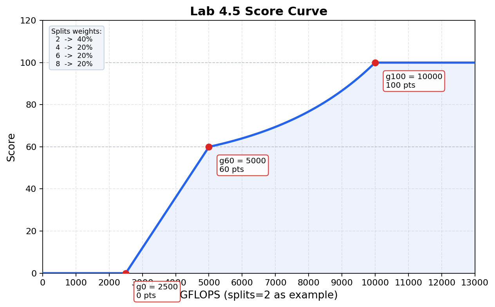

# Lab 4.5：基于 INT8 张量核的 FP64 GEMM 模拟

!!! abstract "实验信息"
    负责助教：刘烨、刘佳鸣

    !!! tip "Bonus 实验"

        这是一个 **Bonus 实验**，不强制要求同学们完成。欢迎学有余力的同学挑战。


## 实验目标

前面的实验中，你已经在单张 GPU 上完成过向量化计算和 kernel 前向优化。本次实验面对的问题略有不同：你不需要从零写一个矩阵乘法 kernel，而是要利用 GPU 的 INT8 张量核来"模拟"一次 FP64 矩阵乘法——在精度可接受的范围内，用低精度算力换取更高的吞吐。

完成本实验后，你应当能够：

- 理解逐级量化分解的原理，并将一个 FP64 矩阵拆分为多个 INT8 分量；
- 在 cuBLAS INT8 GEMM 之上完成分解、计算与 FP64 重组，得到完整且正确的 GEMM 结果；
- 以 `fp64_cublas` 为精度参考、`int8_cublas_baseline` 和 `cublas_emulated` 为性能对照，测量并解释不同实现之间的端到端性能差异；
- 使用 Nsight Systems / Nsight Compute 定位量化、GEMM、重组或中间数据搬运的瓶颈，并在不破坏正确性的前提下进行优化。

## 背景介绍

近年来 NVIDIA 的重心明显转向 AI，新卡的低精度算力（INT8、FP8、FP4）增长远快于 FP64，并且 FP64 算力不仅没涨，反而在逐代缩水：

| GPU | 架构 | 年份 | FP64 Tensor Core | INT8 Tensor Core |
|-----|------|------|------------------|------------------|
| H100 SXM | Hopper | 2022 | 67 TFLOPS | 4 POPS |
| B200 | Blackwell | 2024 | 37 TFLOPS | 9 POPS |
| B300 | Blackwell Ultra | 2025 | $\approx$1.2 TFLOPS | 9 POPS |

从 H100 到 B200，FP64 Tensor Core 不升反降（67→37 TFLOPS）；到了 B300，NVIDIA 干脆把 FP64 单元几乎全部砍掉（37→1.2 TFLOPS，降幅 97%），腾出的面积全部给了 FP4/FP8 推理算力 \[[3]\] \[[4]\]。对于依赖 FP64 的科学计算、分子动力学、气候模拟等 HPC 工作负载，直接在新卡上调用 `cublasDgemm` 已经越来越不划算。

本实验使用的 H800 PCIe 是这一趋势的一个极端代表：它的 INT8 吞吐高达数千 TOPS，而 FP64 Tensor Core 实测仅约 0.8 TFLOPS——两者相差三个数量级。那么，能否"借"低精度算力来完成高精度计算？将 FP64 矩阵逐级量化为 INT8 分量，用 INT8×INT8→INT32 的张量核 GEMM 完成乘法，再在 FP64 下按比例尺累加重组，我们就能利用 INT8 算力完成高精度浮点数运算。Ozaki 等人的工作讨论了基于浮点分裂的准确矩阵乘法 \[[1]\]；CUDA 13 的 cuBLAS 也提供了 FP64 fixed-point emulation，将 FP64 输入量化为定点表示后用 INT8 张量核计算 \[[2]\]；本实验将着眼于前者，在 H800 上实现高性能的高精度浮点数矩阵乘法。


## 算法原理

### 核心思想

FP64 的有效尾数精度为 53 bit。这里使用的量化集合为 $[-127,127]\cap\mathbb{Z}$，共有 255 个取值，等效分辨率接近 8 bit；一次量化不能保留 FP64 的全部有效位。

对正整数 $S$（split 数），本实验的逐级量化将一个 FP64 数 $x$ 近似表示为 $S$ 个 INT8 分量的加权和：

$$x \approx \sum_{i=0}^{S-1} q_i \cdot s_i, \quad q_i \in [-127, 127] \cap \mathbb{Z}$$

其中 $s_i$ 为第 $i$ 级的比例尺，$q_i$ 为对应的 INT8 量化值。比例尺按固定比率递减，使每级量化捕获不同量级的精度信息。

### 分解的构造

**确定初始比例尺** 对非零矩阵 $X$，设 $X_{\max} = \max_{i,j}|X_{ij}|$，取 $s_0=X_{\max}/127$。则对任意元素 $x$ 有 $|x/s_0|\le127$，保证第 0 级量化不溢出。全零矩阵可直接令所有分量为零；此时比例尺无实际意义，代码取 $s_0=1/127$（即 $X_{\max}=1$ 时的值）以避免除零：

$$q_0 = \mathrm{round}\!\left(\frac{x}{s_0}\right) \in [-127, 127]$$

注意这里 $s_0$ 以及后续的 $s_i$ 是整个矩阵的所有元素共用的。这保证了矩阵分解后 $A^{(i)}_q$ 和 $B^{(j)}_q$ 的 GEMM 结果可以直接用标量 $s^A_i \cdot s^B_j$ 进行缩放还原。如果每个元素用不同的比例尺，精度会更高，但重组时需要逐元素乘以不同系数，无法用单次 GEMM 完成，需要进行额外的 Hadamard 乘法，性能大幅下降。

**逐级提取** 定义残差 $r_0 = x$，第 $i$ 级量化后更新残差为：

$$r_{i+1} = r_i - q_i \cdot s_i$$

由于 $q_i = \mathrm{round}(r_i / s_i)$，在未触发饱和的实数算术模型下，量化误差满足：

$$|r_{i+1}| \le \frac{s_i}{2}$$

为保证第 $i+1$ 级量化不溢出（$|q_{i+1}| \le 127$），需要：

$$\frac{|r_{i+1}|}{s_{i+1}} \le 127 \implies s_{i+1} \ge \frac{|r_{i+1}|}{127} $$

而

$$\frac{|r_{i+1}|}{127} \le \frac{s_i / 2}{127} = \frac{s_i}{254}$$

因此，在上述实数算术模型下取 $s_{i+1}=s_i/254$，即可保证 $|r_{i+1}/s_{i+1}|\le127$，并取到不发生饱和时允许的最大缩减率。

**缩减率的选择：** 若取 $s_{i+1} = s_i / C$ 且 $C > 254$，则残差上界 $s_i / 2$ 可能超过 $127 \cdot s_{i+1}$，导致 $q_{i+1}$ 溢出 INT8 范围。反之若 $C < 254$，相同残差区间只使用下一层量化器的一部分动态范围，造成精度浪费。因此 $C = 254$ 是保证不溢出的最大缩减率，也是精度利用率最高的选择。

完整的递推关系为：

$$\boxed{q_i = \mathrm{round}\!\left(\frac{r_i}{s_i}\right), \quad r_{i+1} = r_i - q_i \cdot s_i, \quad s_{i+1} = \frac{s_i}{254}}$$

### 精度分析

$S$ 级分解后，在同一实数算术模型下，单个元素的绝对误差满足：

$$\left|x - \sum_{i=0}^{S-1} q_i \cdot s_i\right| = |r_S| \le \frac{s_{S-1}}{2} = \frac{s_0}{2 \cdot 254^{S-1}} = \frac{X_{\max}}{254^S}$$

将该绝对误差用矩阵最大元素 $X_{\max}$ 归一化，可得：

$$\frac{\left|x - \sum_{i=0}^{S-1} q_i \cdot s_i\right|}{X_{\max}} \le \frac{1}{254^S}$$

这不是逐元素相对误差界：当 $x=0$ 或 $|x|\ll X_{\max}$ 时，不能用 $|x|$ 作统一下界。下表仅列出相对于 $X_{\max}$ 的理论绝对误差界（即 $|r_S|/X_{\max}$）；它不包含 FP64 残差更新、INT32 GEMM 或 FP64 重组产生的舍入误差。

| splits $S$ | 归一化误差上界 | 等效位数 |
|------------|----------------|----------|
| 1 | $1/254 \approx 3.9 \times 10^{-3}$ | $\approx 8$ bit |
| 2 | $1/254^2 \approx 1.5 \times 10^{-5}$ | $\approx 16$ bit |
| 4 | $1/254^4 \approx 2.4 \times 10^{-10}$ | $\approx 32$ bit |
| 8 | $1/254^8 \approx 5.8 \times 10^{-20}$ | $\approx 64$ bit |

$S=8$ 时理论误差已低于 FP64 unit roundoff（约 $2^{-53}$），但这只是理想化分解的误差界，不代表端到端 FP64 等价。

下表将理论上界与 H800 MIG 上的实测 L2 相对误差进行对照（矩阵规模 4096³）：

| splits $S$ | 理论上界 $1/254^S$ | `int8_cublas_baseline` 实测 | `cublas_emulated` 实测 |
|---|---|---|---|
| 2 | $1.5 \times 10^{-5}$ | $2.2 \times 10^{-5}$ | $5.4 \times 10^{-7}$ |
| 4 | $2.4 \times 10^{-10}$ | $3.4 \times 10^{-10}$ | $9.7 \times 10^{-12}$ |
| 6 | $3.8 \times 10^{-15}$ | $5.4 \times 10^{-15}$ | $1.1 \times 10^{-15}$ |
| 8 | $5.8 \times 10^{-20}$ | $1.1 \times 10^{-15}$ | $1.1 \times 10^{-15}$ |

`int8_cublas_baseline` 在 $S \le 6$ 时实测误差与理论上界同数量级，说明量化误差是主要误差来源。$S=8$ 时实测误差远大于理论上界，因为此时量化误差已低于 FP64 舍入误差，整体精度由 FP64 运算主导。

`cublas_emulated` 在相同 splits 下精度普遍优于 `int8_cublas_baseline`，说明 cuBLAS 内部使用了更优的量化策略（如自适应缩减率或动态尾数控制），而非严格使用 $C=254$ 的固定缩减率。

### GEMM 展开

矩阵 $A$ 和 $B$ 分别分解为 $S$ 个 INT8 分量后，令 $\widetilde{A}$、$\widetilde{B}$ 表示其重组结果，则：

$$\widetilde{C}=\widetilde{A}\widetilde{B}=\left(\sum_{i=0}^{S-1} s^A_i A^{(i)}_q\right)\left(\sum_{j=0}^{S-1} s^B_j B^{(j)}_q\right)=\sum_{i=0}^{S-1}\sum_{j=0}^{S-1}s^A_i s^B_j\big(A^{(i)}_qB^{(j)}_q\big),\qquad \widetilde{C}\approx C=AB$$

每个 $A^{(i)}_q B^{(j)}_q$ 是一次 INT8×INT8→INT32 的 GEMM，共 $S^2$ 次；其结果乘以缩放系数 $s^A_i s^B_j$ 后在 FP64 下累加到输出矩阵。当前 benchmark 程序的尺寸满足 INT8 Tensor Core 路径的常见对齐条件，但实际库调度应以 profiler 结果为准。

**为什么需要 $S^2$ 次？** $A$ 和 $B$ 各有 $S$ 个分量，需计算所有 $S \times S$ 种组合。

## 实验任务
`src/lab4p5/submit/my_int8_fp64.cu` 中为大家提供了朴素实现的骨架，同学们按照代码中的提示完成两个核函数就可以拿到基础的分数。如果想要拿到更高的分数，除了改进核函数以外，host 侧函数也需要修改，以实现更加自由高效的调度和编排。

无论实现如何，最后对外提供统一的函数签名：

```c
int gemm_my_int8_fp64(int M, int N, int K,
             const double* dA, const double* dB, double* dC,
             int splits, cublasHandle_t handle, cudaStream_t stream);
```
矩阵采用列主序存储：$C[M\times N] = A[M\times K] \times B[K\times N]$，对应内存布局为 `A[k*M+m]`、`B[n*K+k]`、`C[n*M+m]`。

!!! warning "正确性是优化的前提"
    benchmark 传入的 `splits` 参数不得在实现中擅自缩减。运算结果最后会与基线计算误差，误差过大则当次评测 0 分。


## 代码结构

所有源码位于 `src/lab4p5/` 目录下：
```
src/lab4p5/
├── baseline
│   ├── baseline_fp64.cu
│   ├── cublas_baseline.cu
│   └── cublas_emulated.cu
├── benchmark.cu
├── include
│   ├── gemm_api.h
│   └── utils.h
├── Makefile
├── submit
│   └── my_int8_fp64.cu
└── utils.cu
```

| 文件 | 说明 |
|------|------|
| `gemm_api.h` | 统一函数签名 |
| `utils.cu` / `utils.h` | 计时（`CudaTimer`）、误差比较（`accuracy_compare`）、矩阵填充、max-abs 归约（`device_maxabs_fp64`）、设备内存分配 |
| `baseline_fp64.cu` | cuBLAS FP64 基准 (`gemm_fp64_cublas`，精度与性能参考)  |
| `cublas_baseline.cu` | 朴素 INT8 模拟实现，基于 cuBLAS INT8 GEMM；每个 split 单独量化、每个 $(i,j)$ 单独重组 |
| `cublas_emulated.cu` | cuBLAS 内置的 FP64 fixed-point emulation（`CUBLAS_COMPUTE_64F_EMULATED_FIXEDPOINT`），将 FP64 输入量化为定点表示后用 INT8 张量核计算，`splits` 通过 `max_mantissa_bits = 8 * splits` 控制 cuBLAS 内部保留的尾数位数 |
| `my_int8_fp64.cu` | **需要修改的文件** |
| `benchmark.cu` | 统一测评程序 |
| `Makefile` | 编译脚本 |


## 如何获取计算资源

我们通过[实验平台](https://platform.s.zjusct.io)提供计算资源。你需要：

1. 登录实验平台；
2. 创建预设为 `x86-5418Y` 的 DevPod；
3. 在 DevPod 内获取课程仓库并进入 `src/lab4p5/`。

DevPod 是持久化的开发容器，适合编辑和编译，但**不要在 DevPod 中直接运行 GPU 任务**。正式计时和性能评测必须通过 `hpc submit` 提交到计算分区执行。

本实验使用 H800 PCIe GPU，通过 MIG 技术将一张 H800 切分为多个 GPU 实例，每个实例拥有独立的计算资源和内存空间。MIG 不会改变 GPU 的 CUDA 架构和 compute capability，编译目标仍为 `sm_90a`；但每个实例只拥有整卡的一部分计算单元、显存和显存带宽，因此 `nvidia-smi` 显示的资源规模和程序实测性能不能直接与完整 H800 对比。开发和评测时请以实际分配到的 MIG 实例为准。

| 项目 | 规格 |
|------|------|
| GPU | NVIDIA H800 PCIe（sm_90a，80 GB HBM3） |
| MIG 实例 | 1g.10gb（1 个 GPU 实例，10 GB HBM3） |
| CUDA Toolkit | 13.3 |
| 测试矩阵 | 4096³ 及 8192³，元素为 $[-1, 1]$ 均匀分布随机数 |

更详细的平台使用说明请参考 [集群使用](https://hpc101.zjusct.io/guide/)。

## 构建与运行

在 DevPod 中编译 benchmark：

```bash
cd ~/HPC101/src/lab4p5
export PATH=/usr/local/cuda/bin:$PATH
make
```

提交 GPU 任务到计算分区运行：

```bash
# 交互式调试
hpc submit -p lab4g10 -g 1 --interactive bash

# 在计算节点上运行 benchmark（默认测试 splits=2,4,6,8）
hpc submit -p lab4g10 -g 1 "./benchmark 1024,2048,4096 2,4,6,8 5"

# 导出 CSV
hpc submit -p lab4g10 -g 1 "./benchmark 4096,8192 2,4,6,8 10 --csv > results.csv"

# 使用 ncu / nsys 分析性能
hpc submit -p lab4g10 -g 1 "ncu -o profile ./benchmark 4096 4 1"
hpc submit -p lab4g10 -g 1 "nsys profile -o trace ./benchmark 4096 4 1"
```

`benchmark` 程序对每个矩阵规模和 splits 组合运行所有实现，输出吞吐量（GFLOPS）和相对 `fp64_cublas` 参考结果的 L2 相对误差。每个实现先跑一次预热并同步，再计时 `iters` 次取平均值。使用 `--csv` 输出表头为 `size_M,size_N,size_K,method,splits,time_ms,gflops,max_abs_err,l2_rel_err` 的 CSV 格式表格。

每个测试矩阵规模下输出以下各行：

| 输出行 | 含义 |
|--------|------|
| `fp64_cublas` | 原生 FP64（cuBLAS `cublasDgemm`），精度与性能参考 |
| `int8_cublas_baseline` | 朴素 INT8 模拟实现 |
| `my_int8_fp64` | 你的实现 |
| `cublas_emulated` | cuBLAS 内置的 FP64 fixed-point emulation（`CUBLAS_COMPUTE_64F_EMULATED_FIXEDPOINT`），与你的手动实现使用相同的 split 精度参数对标 |


## 性能分析：从 Profiling 开始

先得到正确结果，再优化端到端时间。

!!! note "瓶颈在哪里？"
    单次 INT8 GEMM 很快，不代表整条模拟路径很快。以 `splits=8` 为例：$S^2 = 64$ 次 GEMM 调用、$2S = 16$ 次量化 kernel、$S^2 = 64$ 次重组 kernel，总计超过 140 次 kernel launch。中间 INT32 结果的读写量是 $64 \times M \times N \times 4$ 字节——这些才是真正的开销。

### 分析流程

1. 用 Nsight Systems 拉一条时间线，看 GEMM、量化、重组各占多少时间，kernel launch 间隙有多少空闲。
2. 用 Nsight Compute 分析热点 kernel 的访存效率、occupancy 和带宽利用率。
3. 一次只改一个点，每次修改后重新测量端到端时间并检查 L2 相对误差。
4. 只保留同时满足误差要求且确实更快的修改。

### 优化方向
#### 算子融合

将量化、INT8 GEMM 和 FP64 重组拆成独立 kernel，代码清晰且便于验证，但 kernel launch 并不是免费的。在最直接的实现中，$A$、$B$ 各需要处理 $S$ 个分量，量化相关 kernel 的启动次数约为 $2S$；若每个 $(i,j)$ 部分积都单独缩放并写回，重组相关 kernel 还可能达到 $S^2$ 次。$S=8$ 时，仅这些阶段就会产生数十次启动。对于计算量较小的 kernel，启动延迟可能与有效计算时间处于同一数量级。

此外，kernel 边界通常意味着中间结果需要写入全局内存，再由下一个 kernel 读回。例如，INT32 部分积若完整落地到 HBM，后续重组至少还要进行一次读取和一次 FP64 输出更新；当 $S^2$ 个部分积依次处理时，这部分内存流量可能压过矩阵乘法本身。因此，融合的价值不仅是减少启动次数，更重要的是**缩短中间数据的路径和生命周期**。

可以按风险从低到高尝试以下几层融合：

1. **融合同一矩阵的多级量化**：一个线程向量化加载若干 FP64 元素，在寄存器中连续更新残差并生成 $q_0, q_1, \ldots, q_{S-1}$，一次 kernel 写出全部 split，避免为每一级重新读取原矩阵。量化商可尝试用 FP32 乘倒数和 `rintf` 计算，但混合精度只应用于**分量选择**；比例尺与残差更新仍应保留 FP64 FMA，并通过误差测试验证。
2. **一次融合重组多个部分积**：先保存需要的 INT32 部分积，再由一个 kernel 对同一输出位置遍历所有 pair，只写一次 FP64 $C$。可以把 scales 预加载到 Shared Memory，并使用 `int4` load 与 `double4` store；这样可把最多 $S^2$ 个重组 launch 降为 1 个，也避免反复读改写 $C$，但仍需为每个保留的 pair 写入并读回一份完整 INT32 矩阵。
3. **把缩放重组并入 GEMM epilogue**：INT8 GEMM 得到一个 INT32 tile 后，立即乘以 $s_i^A s_j^B$ 并累加到 FP64 输出，从而进一步消除完整 INT32 中间矩阵。若多个 GEMM 分别直接更新同一个 $C$，必须解决跨 kernel 的写冲突或串行化问题；更现实的路线是让一个 CTA 连续消费一批 pair，或设计受控的分批 epilogue。
4. **端到端 mega kernel**：将分解、GEMM 和重组放入一个持久化 kernel。它能够消除最多的边界，却也最难处理调度、同步和资源占用，通常应当在前三级优化完成后再考虑。



融合不是越彻底越好。融合后变量存活时间变长，可能提高 registers/thread 和 Shared Memory/CTA，降低一个 SM 上可同时驻留的 CTA 数；寄存器不足还会产生 local-memory spill，反而增加访存。实践中应同时比较 `registers per thread`、Shared Memory 用量、occupancy、DRAM bytes 和 kernel 数量，以“端到端时间下降”而不是“kernel 数量最少”作为选择融合边界的标准。

#### Overlapping：重叠数据搬运与计算

流水线优化的目标不是减少总工作量，而是把一个阶段的等待时间隐藏在另一个阶段的有效工作之后。对按 $K$ 维分块的 GEMM 而言，可以将每个 tile 的处理拆成“从全局内存搬入 Shared Memory → Tensor Core 计算 → 缩放与 FP64 重组”三个阶段。当 Tensor Core 计算 tile $t$ 时，搬运单元预取 tile $t+1$，CUDA Core 则可以处理已经完成的 tile $t-1$，从而让不同硬件资源在时间线上同时保持忙碌。

最常见的实现是 **double buffering** 或多级流水线。Shared Memory 中准备两个或更多缓冲区：producer 向缓冲区 A 写入新 tile 时，consumer 从缓冲区 B 读取旧 tile 进行计算；下一轮交换 A、B 的角色。Hopper 提供 TMA（Tensor Memory Accelerator）执行异步张量搬运，并可在搬运过程中完成多维寻址和适配 Shared Memory 的布局变换。这样，少量 producer 线程即可发起大块数据传输，其余线程不必逐元素执行地址计算。关于 TMA 的进一步介绍可参考 [CuTe 之 Hopper TMA](https://zhuanlan.zhihu.com/p/1985678344352731952)。



重叠执行的前提是正确表达数据依赖。producer 不能覆盖 consumer 尚未读完的缓冲区，consumer 也不能读取尚未完成的异步搬运；因此每一级缓冲区都需要“empty/ready”状态，并通过 `mbarrier`、pipeline primitive 或等价同步机制完成所有权交接。同步过早会把流水线重新串行化，同步不足则会造成数据竞争。

跨 kernel 的依赖需额外注意：在**同一非默认 stream** 中，后续 kernel 会自动等待同一 stream 上的前序 kernel 完成，这种隐式顺序足以建立“量化 → GEMM”的简单依赖；但一旦把生产者和消费者放到**不同 stream** 以便重叠，就应优先用 `cudaEventRecord` / `cudaStreamWaitEvent` 精确表达依赖——`cudaStreamWaitEvent` 只等待事件**当下已记录的那一次** record，后续 record 不会影响既有 wait。切勿依赖默认 stream 的隐式全局同步，`--default-stream per-thread` 等编译选项会改变其语义。

比如矩阵 A/B 的 max-abs 与量化可以分别运行在两条 stream 上，保留的 GEMM 也可以分派到多条 stream，最后再统一重组。但必须建立完整的跨 stream 依赖：A、B 量化完成后分别记录 event，每条 GEMM stream 都等待两个输入 event；各 GEMM stream 完成后再分别记录 event，由重组 stream 等待全部完成。这样既补齐 happens-before，又避免用 `cudaStreamSynchronize` 阻塞 host。尤其不能只同步 B 的生产 stream：另一条 stream 上的 GEMM 同样可能读取尚未完成量化的 A。更细一步，可把部分积划成批次并用 event 或 CUDA Graph 连接，以降低同步和重复提交开销。若要支持多 host 线程、多个独立调用或 CUDA Graph capture，还应把中间缓冲、stream 和 event 放入显式 context/workspace，避免不可重入的全局静态状态，也避免在热路径中创建 stream、分配内存或执行阻塞同步。

本实验还可以进一步按 tile 重叠 Tensor Core 上的 INT8 GEMM 与 CUDA Core 上的地址计算、类型转换和 FP64 重组。不过“可被并发调度”不等于一定获得线性加速：多个饱和 Tensor Core GEMM 往往会竞争同一组 SM，而不是把吞吐直接翻倍；FP64 重组还会竞争 CUDA Core、寄存器和内存带宽。应在时间线中确认是否真正形成重叠，并以端到端时间判断双 stream 是否值得保留。

#### Hopper 架构上的 WGMMA 与 warp specialization

WGMMA（Warpgroup Matrix Multiply-Accumulate）是 Hopper `sm_90a` 上面向 warp group 的异步矩阵乘加接口。一个 warp group 由 **4 个连续 warp，即 128 个线程**组成；这些线程协作发起矩阵乘法并持有分布式累加器。与此前以单个 warp 为主要协作单位的 MMA 接口相比，WGMMA 处理更大的 tile，并允许矩阵乘法与同一 CTA 中其他 warp group 的数据准备工作重叠。这里的“异步”指的是**发起与等待被分离**：warp group 发出指令后，可以在允许的依赖范围内继续推进流水线，随后通过 commit/wait group 语义保证累加器结果在被消费前已经完成——它**不能省略同步**，只是把等待推迟到真正需要结果的位置。WGMMA 在本实验中只承担 INT8×INT8→INT32 主体计算；FP64 缩放与跨 pair 重组仍需由 CUDA Core 或后续 epilogue 完成，不能把“使用 WGMMA”误解为整条数据路径都运行在 Tensor Core 上。

warp specialization 的划分单位是 **warp 或 warp group**，而不是把一个 warp 内的线程再拆成不同职责。典型的 producer-consumer 结构如下：producer warp 负责通过 TMA 发起全局内存到 Shared Memory 的搬运并维护 barrier；consumer warp group 等待 tile 就绪后发起 WGMMA；需要时还可由专门的 warp 处理 epilogue 和写回。各角色通过 Shared Memory 中的多级缓冲区传递数据，使搬运、矩阵乘法和重组形成细粒度流水线。



将这一结构用于本实验时，可以让 producer 准备 $A_q^{(i)}$、$B_q^{(j)}$ 的下一个 K-tile，让 consumer warp group 执行当前 INT8×INT8→INT32 WGMMA，并在合适的阶段把完成的累加器交给 FP64 重组逻辑。实现时需要重点选择 CTA tile、WGMMA tile、pipeline stage 数和各角色的 warp 数。tile 太小会增加调度开销，tile 太大则可能因 Shared Memory 和寄存器占用过高而降低并行度；producer 太少可能喂不满 Tensor Core，太多则会挤占 consumer 的资源。建议先复用 CUTLASS 中已经验证过的 SM90 warp-specialized schedule，再逐项替换数据类型、布局和 epilogue。

使用 CUTLASS 时，可以通过 `CollectiveBuilder` 的 `KernelScheduleAuto` 选择 SM90 warp-specialized/TMA 路径，并用 `StageCountAutoCarveout` 在扣除 epilogue Shared Memory 后决定 mainloop stage 数，而不必手写 `wgmma.*` PTX。CTA tile 和 cluster shape 仍需实测；例如可以把 `128×256×128` CTA tile 与 `1×1×1`、`2×1×1`、`4×1×1` 等 cluster 作为候选。cluster 使相邻 CTA 有机会通过 TMA multicast 复用 operand tile，但收益取决于问题形状、SM 数、MIG 分区、可调度 cluster 数和尾部浪费。同一配置在不同规模的 GPU 分区上可能出现相反排序，因此必须按目标机器重新扫描，不能照抄单一参数。

#### 使用 CUTLASS

CUTLASS 是 NVIDIA 提供的高性能 CUDA C++ 模板库，用于构造 GEMM 及相关算子。与只能选择固定库接口的 cuBLAS 相比，CUTLASS 暴露了 tile shape、数据布局、pipeline stage、kernel schedule 和 epilogue 等编译期参数，因此特别适合本实验这种“主体是标准 INT8 GEMM，但前后处理需要定制”的场景。其底层 CuTe 抽象用 `Tensor`、`Layout`、copy atom 和 MMA atom 描述线程与数据的映射，可以在较高层表达 TMA、Shared Memory swizzle 和 WGMMA，而不必从头手写全部 PTX。

在 CUTLASS 3.x 的 GEMM 结构中，`CollectiveMainloop` 负责将 $A/B$ tile 从全局内存搬到 Shared Memory 并执行主循环矩阵乘法，`CollectiveEpilogue` 负责处理累加器、类型转换和输出写回。本实验可将输入和输出设为列主序，INT8 输入采用 16 元素（128 bit）对齐，INT32 输出采用 4 元素对齐，累加器使用 INT32，并通过 `GemmUniversalAdapter` 在 `sm_90a` 上运行。后续路线应区分“调好标准 GEMM”和“改造 Ozaki 数据流”：

1. **扫描标准 GEMM 配置**：针对目标 $M,N,K$、GPU/MIG 分区测试 CTA tile、cluster shape 与 schedule。`StageCountAutoCarveout` 是可靠起点，但不等于对所有尺寸最优；还要检查尺寸是否满足向量对齐以及 tile/cluster 的整除或 predication 成本。
2. **复用 workspace 和计划**：缓存 CUTLASS workspace 与大块临时缓冲，避免每次调用都 `cudaMalloc`；还应缓存与 problem shape 对应的 kernel 配置，并通过显式 context 管理生命周期，而不是使用不可重入的全局静态状态。
3. **减少 pair 级调度开销**：如果每个保留的 $(i,j)$ 都单独调用一次 CUTLASS GEMM，pair 数较多时会产生明显的启动和调度成本。可考虑 grouped/batched 组织、CUDA Graph，或在自定义 kernel 中一次消费多个 pair；不过各 pair 的 A/B 指针组合和 FP64 权重不同，不能简单假设一次普通 batched GEMM 就能完成最终重组。
4. **定制 Ozaki epilogue 或 tile 级重组**：标准 `CollectiveEpilogue` 可以先输出 INT32 部分积，再由后续 kernel 执行 FP64 缩放；更进一步，可让 epilogue 或后继 tile 消费者直接完成 FP64 转换与缩放，以减少 `n_pairs × M × N × sizeof(int32_t)` 的临时存储和 HBM 往返，同时设计无竞争的跨 pair 累加方式。



CUTLASS 的优势是复用已经优化过的流水线和布局，代价是模板层次较深、编译时间较长，而且自定义 FP64 epilogue 仍可能成为瓶颈。建议先用 CUTLASS Profiler 找到接近目标数据类型和尺寸的 SM90 kernel，再从可运行模板开始修改；每次只替换一个组成部分，并用正确性测试和 profiler 对比，避免同时改变布局、调度和重组逻辑后难以定位问题。还要分别报告**单次 INT8 GEMM 时间**与包含 max-abs、量化、全部 pair、重组和同步的**端到端时间**：前者接近峰值并不代表整个 FP64 模拟路径同样高效。

#### 减少 Shared Memory bank conflict

Shared Memory 被划分为多个可并行访问的 bank。对常见的 32-bank 组织而言，一个 warp 发出的 Shared Memory 指令如果把不同地址集中映射到同一 bank，硬件就需要把请求拆成多次执行；冲突度越高，有效带宽越低。一个简化的 4-bank 模型如下，其中逻辑上连续的 word 轮流映射到不同 bank：

```text
Bank 0    Bank 1    Bank 2    Bank 3
MEM[0]    MEM[1]    MEM[2]    MEM[3]
MEM[4]    MEM[5]    MEM[6]    MEM[7]
MEM[8]    MEM[9]    MEM[10]   MEM[11]
...       ...       ...       ...
```

例如，线程分别访问 `MEM[0]`、`MEM[9]`、`MEM[6]`、`MEM[3]` 时，地址映射到四个不同 bank，可以并行服务；若它们访问 `MEM[0]`、`MEM[4]`、`MEM[8]`、`MEM[12]`，则会形成同一 bank 上的不同地址冲突。需要区分一种例外：多个线程读取同一 bank 的**同一地址**时，Shared Memory 可以广播该值，这通常不计为 bank conflict。



GEMM 中的 Shared Memory tile 常常会被转置读取，或者被 WGMMA 按特定 fragment 方式消费；即使全局内存写入是连续的，简单的行主序/列主序 Shared Memory 布局也可能在读取阶段产生高阶冲突。常见的解决方法包括：

- **padding**：将 leading dimension 从 `TILE_K` 改为 `TILE_K + PAD`，打破固定步长与 bank 数的公因子；
- **swizzle/permuted layout**：用行号的部分 bit 对列地址做置换，使相邻线程在转置访问时分散到不同 bank；
- **匹配访问粒度和对齐**：结合向量化 load/store、WGMMA 要求以及元素宽度设计布局，而不是只按二维矩阵的直观顺序存储；
- **让 TMA 写入目标布局**：在 Hopper 上利用 TMA 与 CuTe layout 将全局内存中的规则 tile 搬成计算阶段所需的 Shared Memory 布局，减少手工重排指令。

布局优化必须同时检查写入和读取两侧：消除 producer 的冲突却增加 consumer 的冲突，未必有净收益。可用 Nsight Compute 的 Shared Memory load/store transaction、bank-conflict 相关指标以及 kernel 总时间验证；具体的布局示例可参考 [CuTe 之 Hopper TMA](https://zhuanlan.zhihu.com/p/1990792939232835390)。

#### 其他优化思路



1. **减少全局内存访问，提高数据复用。** 对 $M/N/K$ 三个维度进行 tiling，把 $A/B$ 子块缓存在 Shared Memory，把输出子块或部分累加状态尽量保留在寄存器中，使一次 HBM 加载能够服务多次 MMA。还应避免每个 $(i,j)$ 部分积都对完整 $C$ 做一次读改写；可以按输出 tile 或按若干 split 组合分批累加。优化后应观察 DRAM bytes 是否下降、L2 命中率和 arithmetic intensity 是否提高，而不能只比较指令数。

2. **优化全局内存访问模式。** 让同一 warp 的线程访问连续且对齐的地址，以便合并为尽可能少的内存事务；必要时使用 `int4`、`uint4` 等向量化访问，但必须保证地址和 leading dimension 满足对齐要求。当前矩阵为列主序，因此线程到 `A[k*M+m]`、`B[n*K+k]` 和 `C[n*M+m]` 的映射应分别设计，不能对三个矩阵机械套用同一种线程布局。边界 tile 可以采用 predication 或独立的 remainder kernel，避免正常路径承担大量越界判断。需要注意，**全局内存 coalescing 与 Shared Memory bank conflict 是不同层级的问题**，应分别分析。

3. **减少分支与 warp divergence。** 当同一 warp 内不同线程执行不同分支时，各路径会被依次执行，未参与当前路径的线程处于空闲状态。可将常见的整齐尺寸作为无分支 fast path，把边界情况拆到单独 kernel；对简单的边界条件优先使用 predication，并将只与 tile 或 warp 有关的判断移到循环外。模板参数和循环展开还能把 splits、tile shape 等运行时分支转化为编译期选择，但展开过度会增大代码体积和寄存器压力，因此仍需实测。

4. **在误差预算内做精度取舍。** 低精度并不意味着所有变量都应降精度。INT8 分量和 INT32 Tensor Core 累加是算法的计算主体，而比例尺 $s_i^A s_j^B$、残差更新、跨部分积的求和及最终输出通常仍应保留 FP64，以避免小量级分量在重组时被吞掉。量化商和 max-abs 归约可尝试 FP32，但它们会影响分量选择与初始比例尺，必须覆盖动态范围大、接近量化边界、含全零矩阵以及非 16 倍数尾部等用例，不能只在随机均匀矩阵上验证。

5. **按反对角线裁剪 split pair。** 由于 $s_i^A s_j^B$ 随 $i+j$ 近似按 $254^{-(i+j)}$ 衰减，优先保留 $i+j<d$ 的组合，往往比随意删去 pair 更符合误差结构。实现时只为保留的 pair 分配紧凑 INT32 缓冲，可以同时减少 GEMM 次数、临时显存和重组流量。但阈值 $d$ 取决于 splits、输入分布和误差目标，不存在适用于所有场景的固定值。提交结果时应给出“阈值—保留 pair 数—时间—最大绝对误差—L2 相对误差”曲线，并在需要严格上界时使用残差范数或保守误差界，而非只凭比例尺大小判断。

6. **摊薄分配、同步和提交成本。** 反复 `cudaMalloc/cudaFree`、创建 stream、从 device 拷回归约结果并 host-side reduce，都会进入端到端时间。可以预分配 workspace、复用 stream/event、用第二级 device reduction 避免传回数千个 partial，或用 CUDA Graph 降低固定 shape 下重复执行的 launch 开销。缓存键必须包含所有影响容量和布局的参数；例如 pair 裁剪阈值改变后，`n_pairs` 和临时缓冲容量也会改变，不能只按 $M,N,K,$ splits 判断是否需要重新分配。

7. **检查 INT32 累加范围。** 单个 INT8 GEMM 元素的最坏情况量级约为 $K_{\mathrm{dim}}\cdot127^2$；当 $K_{\mathrm{dim}}$ 足够大时可能超过有符号 INT32 范围。以全同号极值作保守估算，需满足 $K_{\mathrm{dim}}\cdot127^2\le 2^{31}-1$（约 $K_{\mathrm{dim}}\le133144$）。当前 benchmark 规模远低于该阈值，但若扩展到更长 K、非随机高幅输入或沿 K 分块后再次做整数累加，应显式验证范围，必要时分段转换到 FP64。

这些优化之间存在耦合：更大的 tile 能提高复用，却增加 Shared Memory 和寄存器占用；更多 pipeline stage 能隐藏延迟，却可能降低 occupancy；更激进的融合能减少 HBM 流量，却会延长 FP64 累加器的生命周期；更激进的 pair 裁剪能减少主要计算量，却直接改变误差。一个可靠的调优流程应当是：**profile → 提出单一瓶颈假设 → 修改一个参数 → 同时验证性能与精度 → 保留或回退**。


## 评分方式

### 正确性要求

性能评分前会先验证正确性。对每个测试规模和 splits 组合，`my_int8_fp64` 的输出会与 `fp64_cublas` 参考结果比较，要求 L2 相对误差低于阈值。正确性不通过的规模或 splits 组合得 0 分。

### 性能评分

性能指标为 `my_int8_fp64` 在各 splits 下的吞吐量（GFLOPS）。每个 splits 参数对应一组固定的 GFLOPS checkpoint，不依赖实时 cuBLAS 测量结果。

每个 splits 参数下的得分曲线如下图所示（横轴为 GFLOPS，以 splits=2 为例）：



具体定义如下：

$$
S(g)=
\begin{cases}
0, & g \le g_0, \\[2pt]
60\dfrac{g - g_0}{g_{60} - g_0}, & g_0 < g \le g_{60}, \\[6pt]
60 + 40\dfrac{e^{1.5 u} - 1}{e^{1.5} - 1},
    & g_{60} < g \le g_{100}, \\[6pt]
100, & g > g_{100},
\end{cases}
$$

其中 $u = \dfrac{g - g_{60}}{g_{100} - g_{60}}$，$g$ 为 `my_int8_fp64` 的实测 GFLOPS。

各 splits 的 checkpoint（GFLOPS）如下表：

| splits | $g_0$（0 分） | $g_{60}$（60 分） | $g_{100}$（100 分） |
|-------|------------:|--------------:|----------------:|
| 2     | 2500       | 5000          | 10000           |
| 4     | 750        | 2500          | 5000            |
| 6     | 350        | 1500          | 3000            |
| 8     | 200        | 1500          | 3000            |

- $g \le g_0$：基本没有有效优化，得 0 分。
- $g = g_{60}$：超过朴素 baseline 的水平，得 60 分。
- $g = g_{100}$：达到 cuBLAS 内置 fixed-point emulation 的性能，得 100 分。
- $g > g_{100}$：超过 cuBLAS，仍得 100 分（满分封顶）。

### 测试规模与权重

测试矩阵规模为 4096³ 和 8192³，splits 取 2、4、6、8。每个规模下取各 splits 得分的算术平均，再按规模等权平均。各 splits 的权重为：

| splits | 权重 |
|--------|------|
| 2 | 40% |
| 4 | 20% |
| 6 | 20% |
| 8 | 20% |

最终得分公式为：

$$
\text{Score} = \frac{1}{2}\sum_{M \in \{4096, 8192\}} \sum_{S \in \{2,4,6,8\}} w_S \cdot S_M(g_{M,S})
$$

其中 $w_2 = 0.4$，$w_4 = w_6 = w_8 = 0.2$，$g_{M,S}$ 是规模 $M$ 下 splits=$S$ 时 `my_int8_fp64` 的实测 GFLOPS，$S_M(g_{M,S})$ 是对应的得分。

## 提交要求

1. 修改后的 `src/lab4p5/submit/my_int8_fp64.cu`。

## 参考资料

1. Katsuhisa Ozaki, Takeshi Ogita, Shin'ichi Oishi, and Siegfried M. Rump. “Error-free transformations of matrix multiplication by using fast routines of matrix multiplication and its applications.” *Numerical Algorithms*, 59(1):95-118, 2012. [doi:10.1007/s11075-011-9478-1](https://doi.org/10.1007/s11075-011-9478-1)
2. NVIDIA. “cuBLAS Library Documentation,” CUDA Toolkit 13.3, §1.5 Floating Point Emulation. [https://docs.nvidia.com/cuda/cublas/](https://docs.nvidia.com/cuda/cublas/)
3. NVIDIA. “NVIDIA H100 GPU: Product Specifications.” [https://www.nvidia.com/en-us/data-center/h100/](https://www.nvidia.com/en-us/data-center/h100/)
4. NVIDIA. “Datasheet for NVIDIA Blackwell Architecture” (B200) and “Datasheet for NVIDIA Blackwell Ultra” (B300). [https://www.nvidia.com/en-us/data-center/blackwell-architecture/](https://www.nvidia.com/en-us/data-center/blackwell-architecture/)
